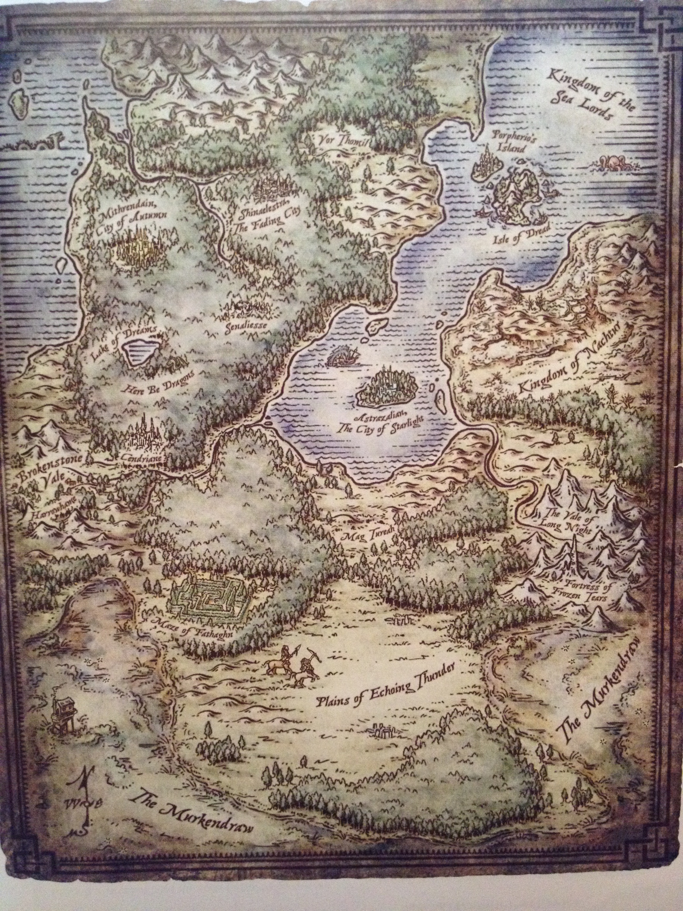

# Fey Court

## Overview

Eventually, humanity started going into the Feywild and assassinating members of the Fey Court. The Redemption of Liam, a pageant about Liam Bloodstone's triumph over the Fey Court, is performed annually by the teachers of Sophronia's bard college to remind the kings, and the people, of the importance of a king who protected the people from danger, but who is also willing to sacrifice for the people. Cyric the Warlord devastated the Fey Court's Eladrin army there and the Summer Queen retaliated by sending her most powerful general, Badb, to decimate the city.

## Beliefs

- Chapter 2: The boat and the spirit naga-.. _(source: [[raw/runesite/10-16.html.md|raw/runesite/10-16.html.md]])_
- Holy cow that’s a big serpent. _(source: [[raw/runesite/10-16.html.md|raw/runesite/10-16.html.md]])_
- Beau shoots a large fireball at the Spirit Naga who shrieks in pain. _(source: [[raw/runesite/10-16.html.md|raw/runesite/10-16.html.md]])_
- The largest city in the Domhaine an Duine, the Kingdom of Atania was home to The Engineering School and the Church of the Creator . _(source: [[raw/runesite/atania.html.md|raw/runesite/atania.html.md]])_

## Practices and Structure

- We relay to Mozet all of the information we know, and ask him if he has heard of anything about a grand device or ritual used to enslave the entire Goblin race. _(source: [[raw/runesite/10-16.html.md|raw/runesite/10-16.html.md]])_
- The largest city in the Domhaine an Duine, the Kingdom of Atania was home to The Engineering School and the Church of the Creator . _(source: [[raw/runesite/atania.html.md|raw/runesite/atania.html.md]])_
- Finally, after Gibbard imposed order, the descendants of Grok and the surviving noble houses were able to begin rebuilding Atania as a trading port and center of magical and technological advancement. _(source: [[raw/runesite/atania.html.md|raw/runesite/atania.html.md]])_
- The Goblin Engineering Guild, founded by Goblin Wizard Grok, has turned Atania into a manufacturing hub. _(source: [[raw/runesite/atania.html.md|raw/runesite/atania.html.md]])_
- The Temple of the Great Creator The temple was built on solid foundations, in an area that was not directly over the limestone caverns. _(source: [[raw/runesite/atania.html.md|raw/runesite/atania.html.md]])_

## Notable Members

- Summer Queen (3 mentions)
- Aspect (1 mention)
- Badb (1 mention)
- Cassandra Songcrest (1 mention)
- Cassandra's (1 mention)
- [[entities/characters/01-origin-figures/cyric.md|Cyric]] (1 mention)
- Eventually (1 mention)
- Fey Court's Eladrin (1 mention)
- Frost Prince (1 mention)
- Inform (1 mention)
- [[entities/characters/02-the-gaeas-falls/liam.md|Liam]] (1 mention)
- Liam Bloodstone's (1 mention)

## Associated Locations

- [[entities/locations/atania.md|Atania]] (101 mentions)
- [[entities/locations/ghealdar.md|Ghealdar]] (21 mentions)
- [[entities/locations/the-feywild.md|The Feywild]] (15 mentions)
- [[entities/locations/the-free-states.md|The Free States]] (3 mentions)

## Important Historical Events

- [[entities/history/hartland-war.md|Hartland War]] (3 references; sample sources: [[raw/runesite/atania.html.md|raw/runesite/atania.html.md]], [[raw/runesite/ghealdar.html.md|raw/runesite/ghealdar.html.md]])
- Elemental Apocalypse (2 references; sample sources: [[raw/runesite/atania.html.md|raw/runesite/atania.html.md]], [[raw/runesite/ghealdar.html.md|raw/runesite/ghealdar.html.md]])

## Visual References

## Canonical Sources

- [[raw/runesite/10-16.html.md|raw/runesite/10-16.html.md]]
- [[raw/runesite/atania.html.md|raw/runesite/atania.html.md]]
- [[raw/runesite/ghealdar.html.md|raw/runesite/ghealdar.html.md]]
- [[raw/runesite/niko-the-frost-prince.html.md|raw/runesite/niko-the-frost-prince.html.md]]
- [[raw/runesite/the-feywild.html.md|raw/runesite/the-feywild.html.md]]
- [[raw/stories/An Argument of Fairies V2 copy.docx.md|raw/stories/An Argument of Fairies V2 copy.docx.md]]

## Where This Organization Appears

- [[raw/runesite/10-16.html.md|raw/runesite/10-16.html.md]] - planes were then threatened and consumed by this war. Eventually, humanity started going into the Feywild and assassinating members of the Fey Court. To put a stop to this, the Fey creatures partnered with the elves and other Fey mortals to create a grand G...
- [[raw/runesite/atania.html.md|raw/runesite/atania.html.md]] - ad led the country in an unbroken line of succession since then. The Redemption of Liam, a pageant about Liam Bloodstone's triumph over the Fey Court, is performed annually by the teachers of Sophronia's bard college to remind the kings, and the people, of...
- [[raw/runesite/ghealdar.html.md|raw/runesite/ghealdar.html.md]] - ar The second largest city in Domhaine an Duine, Ghealder was left a smoking ruin after the Hartland war. Cyric the Warlord devastated the Fey Court's Eladrin army there and the Summer Queen retaliated by sending her most powerful general, Badb, to decimate...
- [[raw/runesite/niko-the-frost-prince.html.md|raw/runesite/niko-the-frost-prince.html.md]] - s he liked but it would not change the fact that now he was a fey lord, the Frost Prince. He thought about the dealings he had had with the Fey Court, he remembered how resistant to action they had been, how unwilling to change and it occurred to him that h...
- [[raw/runesite/the-feywild.html.md|raw/runesite/the-feywild.html.md]] - aine an Duine, off the coast of Atania. Niko the Frost Prince - Replacing the former Frost Prince, Nikos has yet to come into his own. The Fey Court went wild when one of their members was killed and replaced. Only the Lady trusts Nikos, and all members of...
- [[raw/stories/An Argument of Fairies V2 copy.docx.md|raw/stories/An Argument of Fairies V2 copy.docx.md]] - t its head. “Tell the Cùmhnantach that we will send word of instruction. Inform the Summer Queen that I demand an audience with her and the Fey Court. The Gaeas is breached, and we must discuss it. Immediately.” Sophronia sat at the freshly covered grave of...
